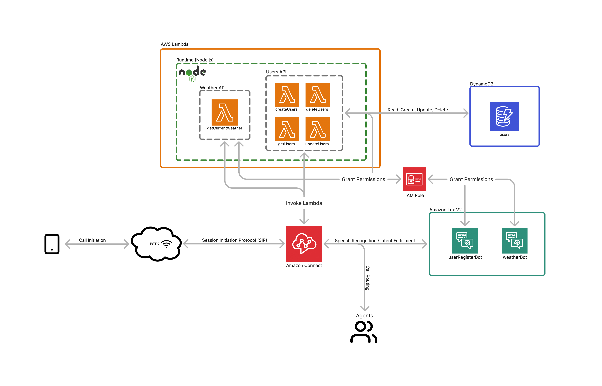

<a id="readme-top"></a>

[![Contributors][contributors-shield]][contributors-url]
[![Forks][forks-shield]][forks-url]
[![Stargazers][stars-shield]][stars-url]
[![Issues][issues-shield]][issues-url]
[![MIT License][license-shield]][license-url]
[![LinkedIn][linkedin-shield]][linkedin-url]

<!-- PROJECT LOGO -->
<br />
<div align="center">
  

  <div align="center">
    <h3>Contact Center App</h3>
    <a href="https://github.com/john-jaihyek-choi/contact-center-app"><strong>Explore the docs »</strong></a>
    <br />
    <br />
    <a href="tel:+15092604508">Demo: (509) 260-4508</a>
    ·
    <a href="https://github.com/john-jaihyek-choi/contact-center-app/issues/new?labels=bug&template=bug-report---.md">Report Bug</a>
    ·
    <a href="https://github.com/john-jaihyek-choi/contact-center-app/issues/new?labels=enhancement&template=feature-request---.md">Request Feature</a>
  </div>
</div>

<!-- UPDATE -->

<!-- ## Update

Body section for Update -->

<br />

<!-- TABLE OF CONTENTS -->
<details>
  <summary>Table of Contents</summary>
  <ol>
    <!-- <li>
      <a href="#preview">Preview</a>
    </li> -->
    <li>
      <a href="#about-the-project">About The Project</a>
    </li>
    <li>
      <a href="#features">Features</a>
    </li>
    <li>
      <a href="#architecture-diagram">Architecture Diagram</a>
    </li>
    <li>
      <a href="#getting-started">Getting Started</a>
      <ul>
        <li><a href="#prerequisites">Prerequisites</a></li>
        <li><a href="#installation">Installation</a></li>
      </ul>
    </li>
        <li>
      <a href="#ivr-logic-flow">IVR Logic Flow</a>
    </li>
    <!-- <li><a href="#usage">Usage</a></li> -->
    <!-- <li><a href="#roadmap">Roadmap</a></li> -->
    <li><a href="#contributing">Contributing</a></li>
    <li><a href="#license">License</a></li>
    <li><a href="#contact">Contact</a></li>
    <!-- <li><a href="#acknowledgments">Acknowledgments</a></li> -->
  </ol>
</details>

<!-- PREVIEW -->

<!-- ## Preview

<p align="center">
  
</p>

<p align="right">(<a href="#readme-top">back to top</a>)</p> -->

<!-- ABOUT THE PROJECT -->

## About The Project

Interactive phone contact center application built utilizing Amazon Connect, DynamoDB, Lambda, Node.js deployed using Serverless framework

<p align="right">(<a href="#readme-top">back to top</a>)</p>

<!-- FEATURES -->

## Features

- Caller is greeted with names on profile
- Caller can direct their call to Sales, Customer Service, and Technical Support representatives through DTMF
- Caller can be placed on a customer queue until the representative becomes available
- Caller can leave a callback number in a callback queue if no other representatives are online
- Caller can create, read, update, delete their profile
- Caller can retrieve current weather information based on their DTMF/Amazon Lex input
  - Possible Input:
    - By city
    - By zip
- Caller can transfer directly to John

<p align="right">(<a href="#readme-top">back to top</a>)</p>

<!-- ARCHITECTURE DIAGRAM -->

## Architecture Diagram

|                            | Languages / Tools / Services                                                                                                                                  |
| -------------------------- | ------------------------------------------------------------------------------------------------------------------------------------------------------------- |
| **Language**               | [![JavaScript][JavaScript]][JavaScript-url]                                                                                                                   |
| **Backend**                | [![AWSLambda][AWSLambda]][AWSLambda-url] [![Node.js][Node.js]][Node.js-url] [![APIGateway][APIGateway]][APIGateway-url] [![DynamoDB][DynamoDB]][DynamoDB-url] |
| **Frontend (User-facing)** | [![AmazonConnect][AmazonConnect]][AmazonConnect-url] [![AmazonLex][AmazonLex]][AmazonLex-url]                                                                 |
| **Infrastructure**         | [![Serverless][Serverless]][Serverless-url]                                                                                                                   |
| **APIs**                   | [![OpenWeatherAPI][OpenWeatherAPI]][OpenWeatherAPI-url]                                                                                                       |

<p align="center">
  
</p>

### Database Schema

This application uses single DynamoDB Table usersTable

- userTable stores users' phone number and name information and is primarily used for dynamic greeting

#### Table Attributes

| Attribute Name | Attribute Type | Primary Key | Description         |
| -------------- | -------------- | ----------- | ------------------- |
| phoneNumber    | String         | Yes         | Users' phone number |
| fName          | String         | No          | User's first name   |
| lName          | String         | No          | User's last name    |

#### Example Table

| phoneNumber (String) | fName (String) | lName (String) |
| -------------------- | -------------- | -------------- |
| 562xxxxxxx           | Spongebob      | Squarepants    |
| 213xxxxxxx           | Bob            | TheBuilder     |
| 909xxxxxxx           | Coding         | John           |

<p align="right">(<a href="#readme-top">back to top</a>)</p>

<!-- GETTING STARTED -->

## Getting Started

This is an example of how you may give instructions on setting up your project locally.
To get a local copy up and running follow these simple example steps.

### Prerequisites

1. Install NPM
   ```sh
   npm install npm@latest -g
   ```
1. Setup and configure aws and serverless from the below links:

   - [AWS-SDK Node.js](https://docs.aws.amazon.com/sdk-for-javascript/v2/developer-guide/getting-started.html)
   - [Serverless](https://www.serverless.com/)
   - [Node.js](https://nodejs.org/en/download/)

   \*\* Make sure that when you are setting up AWS Services, the region is set identical to the profile.region information on serverless.yml

### Installation

#### Repo Setup and Dependency Installation

1. Clone the repo
   ```sh
   git clone https://github.com/john-jaihyek-choi/contact-center-app.git
   ```
2. Navigate to the cloned directory

   ```shell
   cd <repo-name>/
   ```

#### Environment Setup

1. Open your serverless.yml file, and on the very top of the file, edit service name to your desired name:

   ```yaml
   service: desired-name

   custom:
     settings:
       USERS_TABLE: users
   ```

2. On CONTACT-CENTER-APP directory, create a .env file and include the following information (Note: you will need [Open Weather API](https://openweathermap.org/appid) Key for this):

   ```
   OWM_API_KEY=your_API_KEY
   ```

3. Save all the changes

#### Deploy lambda functions

1. Navigate to the root directory of the repo

   ```shell
   cd <repo-name>/
   ```

2. Deploy Lambda via serverless:

   ```
   sls deploy -v
   ```

3. Once deployed, you should be seeing something close to this:

   ```
   Serverless: Stack update finished...
   Service Information
   service: contact-center-app
   stage: dev
   region: us-west-2
   stack: contact-center-app-dev
   resources: 43
   ......
   ```

4. After a successful deployment, check your AWS Lambda and see if all the functions have been created properly

#### Exporting Amazon Connect contact flows

- Since the contact flows cannot be installed automatically, you will need to export all the existing contact flows from [my Amazon Connect instance](https://vf-assessment.awsapps.com/connect/login)

- If you click [my Amazon Connect instance](https://vf-assessment.awsapps.com/connect/login), you will be taken to a log-in page

- Input the following log-in credentials (This account will only have viewing abilities and exporting abilities):

  - ID: githubUser
  - Pass: Password123

- once you log in, click the Contact Flows from the Routing tab on the left

- Then find all contact starting with "VF" (total of 18, but can increase as I update)

- Click on one of them and you will see "Export flow(beta)" button on the right top

- Click the button and save in to a desired local directory

- Repeat the above process until you export all of its content

#### Exporting Amazon Lex Intents

- Lastly, you need to export Amazon Lex bot to listen for customer's intent on your app

- Locate to your /contact-center-app/lexBots directory and there should be 2 .json files

- Go to your [Amazon Lex account](https://aws.amazon.com/lex/) and log-in

- After you log in, click Bots on the left tab and click the "Action" dropdown button next to create button

- Follow their procedure and import two lexBot files

#### Add Amazon Connect Instance

- To start using Amazon Connect, you need to set up an instance

- Please go to [Amazon Connect](https://console.aws.amazon.com/connect/home?p=cnnt&cp=bn&ad=c) and log-in

- Once you log in, you will be taken to Amazon Connect Virtual Contact Center Instances page

- Click Add an Instance button on the left and follow the basic procedure to make your instance

#### Set up Routing Profile and Agent Profiles

- You will need to set up routing profile and agent profile manually since they dont have import options

- Refer to [my Amazon Connect profile](https://vf-assessment.awsapps.com/connect/login) to set up a proper routing and agent profiles suitable for this implementation

#### Configuring your Amazon Connect for Lambda and Lex

- Now that you are all prepared, we need to configure your Amazon Connect to be able to call Lambda functions and use Lex bots

- From the Amazon Connect Virtual Contact Center Instances page, click on your instance

- Then click on Contact Flows tab on the left

- You will see a section for Amazon Lex and AWS Lambda

- Select the proper region for each of them and add all of the Lambda Functions and Amazon Lex bots you have that is relevant to this instance

#### Final tweeks

- Since you've imported all the contact flows from Connect instance, our arn for Lambda invokation are different

- This means you need to make sure that you are adjusting the changes

- Unfortunately, this needs to be done manually:

  - Click into each of the contact flows that has Invoke AWS Lambda function block
  - Once you navigate to the correct block and click it, you will see a dropdown
  - Select the corresponding function that serves its need (ex. createUser, updateUser, etc)

- Once Lambda is properly set, check Lex Bots again too:
  - Click into each of the contact flows that has Get Customer Input which uses Amazon Lex
  - Once you navigate to the correct block and click it, you will see a dropdown
  - Select the corresponding lex bot to use for that block (ex. userRegisterBot and weatherBot)

#### Finalize and publish contact flow

- Finally, make sure to publish all the changes on your contact flow and try calling the number associated with your Connect Instance

<p align="right">(<a href="#readme-top">back to top</a>)</p>

## IVR Logic Flow

- Press 1 / 2 / 3:
  - Caller can join customer queue if there are currently available Sales representatives
  - When there are no available representatives:
    - Press 1:
      - Caller can leave their callback number to be placed in callback queue
    - Press 2:
      - Caller can hang up
- Press 4:
  - Caller navigates to the Profile menu flow
    - Press 1: Caller can create a new profile
    - Press 2: Caller can update an existing profile
    - Press 3: Caller can delete an existing profile
    - Press 4: Caller can return to the main menu
- Press 5:
  - Caller navigates to the Bonus Features menu
    - Press 1: Caller can get current weather of desired city
- Press 0:

  - Caller is directly transferred to John's personal number

<p align="right">(<a href="#readme-top">back to top</a>)</p>

<!-- USAGE EXAMPLES -->

<!-- ## Usage

Use this space to show useful examples of how a project can be used. Additional screenshots, code examples and demos work well in this space. You may also link to more resources.

_For more examples, please refer to the [Documentation](https://example.com)_

<p align="right">(<a href="#readme-top">back to top</a>)</p> -->

<!-- ROADMAP -->

<!-- ## Roadmap

- [x] Add Changelog
- [x] Add back to top links
- [ ] Add Additional Templates w/ Examples
- [ ] Add "components" document to easily copy & paste sections of the readme
- [ ] Multi-language Support
  - [ ] Chinese
  - [ ] Spanish

See the [open issues](https://github.com/othneildrew/Best-README-Template/issues) for a full list of proposed features (and known issues).

<p align="right">(<a href="#readme-top">back to top</a>)</p> -->

<!-- CONTRIBUTING -->

## Contributing

If anyone would be interested in contributing to the development/enhancement of this application, please don't hesitate to do so, any help would be **greatly appreciated**

For any suggestion or enhancement requests, please fork the repo and create a pull request, or simply open an issue with the tag "enhancement".

1. Fork the Project
2. Create your Feature Branch (`git checkout -b feature/AmazingFeature`)
3. Commit your Changes (`git commit -m 'Add some AmazingFeature'`)
4. Push to the Branch (`git push origin feature/AmazingFeature`)
5. Open a Pull Request

### Contributors:

<a href="https://github.com/john-jaihyek-choi/contact-center-app/graphs/contributors">
  
</a>

<p align="right">(<a href="#readme-top">back to top</a>)</p>

<!-- LICENSE -->

## License

Distributed under the MIT License. See `LICENSE.txt` for more information.

<p align="right">(<a href="#readme-top">back to top</a>)</p>

<!-- CONTACT -->

## Contact

John Choi - [website](https://johnjhc.com) - choi.john.jh@gmail.com

Project Link: [https://github.com/john-jaihyek-choi/contact-center-app](https://github.com/john-jaihyek-choi/contact-center-app)

<p align="right">(<a href="#readme-top">back to top</a>)</p>

<!-- ACKNOWLEDGMENTS -->

## Acknowledgments

List of resources found helpful during development

- [Development Notes](https://drive.google.com/drive/folders/13E3P1bX-BndtGd4sM6ZK-oJWlFKMM76K?usp=sharing)

<!-- <p align="right">(<a href="#readme-top">back to top</a>)</p>

<!-- BADGES -->

<!-- Badges available - https://shields.io/badges -->

[contributors-shield]: https://img.shields.io/github/contributors/john-jaihyek-choi/contact-center-app?style=for-the-badge
[contributors-url]: https://github.com/john-jaihyek-choi/contact-center-app/graphs/contributors
[forks-shield]: https://img.shields.io/github/forks/john-jaihyek-choi/contact-center-app?style=for-the-badge
[forks-url]: https://github.com/john-jaihyek-choi/contact-center-app/network/members
[stars-shield]: https://img.shields.io/github/stars/john-jaihyek-choi/contact-center-app?style=for-the-badge
[stars-url]: https://github.com/john-jaihyek-choi/contact-center-app/stargazers
[issues-shield]: https://img.shields.io/github/issues/john-jaihyek-choi/contact-center-app?style=for-the-badge
[issues-url]: https://github.com/john-jaihyek-choi/contact-center-appues
[license-shield]: https://img.shields.io/github/license/john-jaihyek-choi/contact-center-app?style=for-the-badge
[license-url]: https://github.com/john-jaihyek-choi/contact-center-app/master/LICENSE.txt
[linkedin-shield]: https://img.shields.io/badge/-LinkedIn-black.svg?style=for-the-badge&logo=linkedin&colorB=555
[linkedin-url]: https://linkedin.com/in/johnjaihyekchoi
[React.js]: https://img.shields.io/badge/React-20232A?style=for-the-badge&logo=react&logoColor=61DAFB
[React-url]: https://reactjs.org/
[Next.js]: https://img.shields.io/badge/next.js-000000?style=for-the-badge&logo=nextdotjs&logoColor=white
[Next.js-url]: https://nextjs.org/
[Bootstrap.com]: https://img.shields.io/badge/Bootstrap-563D7C?style=for-the-badge&logo=bootstrap&logoColor=white
[Bootstrap-url]: https://getbootstrap.com
[HTML5]: https://img.shields.io/badge/HTML5-red?style=for-the-badge&logo=html5&labelColor=%E34F26&logoColor=white
[HTML5-url]: https://html.com/html5/
[CSS3]: https://img.shields.io/badge/CSS3-white?style=for-the-badge&logo=css3&logoColor=white&labelColor=%231572B6&color=%231572B6
[CSS3-url]: https://css3.com
[Express.js]: https://img.shields.io/badge/Express.JS-white?style=for-the-badge&logo=express&logoColor=white&labelColor=%23000000&color=%23000000
[Express.js-url]: https://express.com
[Python]: https://img.shields.io/badge/Python-white?style=for-the-badge&logo=python&logoColor=white&labelColor=%233776AB&color=%233776AB
[Python-url]: https://python.org
[JavaScript]: https://img.shields.io/badge/JavaScript-white?style=for-the-badge&logo=javascript&logoColor=%23F7DF1E&labelColor=black&color=black
[JavaScript-url]: https://javascript.com
[TypeScript]: https://img.shields.io/badge/TypeScript-white?style=for-the-badge&logo=typescript&logoColor=white&labelColor=balck&color=%233178C6
[TypeScript-url]: https://www.typescriptlang.org/
[Node.js]: https://img.shields.io/badge/Node.JS-white?style=for-the-badge&logo=nodedotjs&logoColor=%235FA04E&labelColor=black&color=black
[Node.js-url]: https://nodejs.org/en
[PostgreSQL]: https://img.shields.io/badge/PostgreSQL-white?style=for-the-badge&logo=postgresql&logoColor=white&labelColor=%234169E1&color=%234169E1
[PostgreSQL-url]: https://www.postgresql.org/
[AWSEC2]: https://img.shields.io/badge/AWS%20EC2-orange?style=for-the-badge&logo=amazonec2&labelColor=%FF9900&logoColor=white
[AWSEC2-url]: https://aws.amazon.com/pm/ec2/
[AWSLambda]: https://img.shields.io/badge/AWS%20Lambda-gray?style=for-the-badge&logo=awslambda&labelColor=%23FF9900&logoColor=white
[AWSLambda-url]: https://aws.amazon.com/pm/lambda/
[S3]: https://img.shields.io/badge/AWS%20S3-gray?style=for-the-badge&logo=amazons3&labelColor=%569A31&logoColor=%569A31
[S3-url]: https://aws.amazon.com/s3/
[APIGateway]: https://img.shields.io/badge/AWS%20API%20Gateway-gray?style=for-the-badge&logo=amazonapigateway&labelColor=%FF4F8B&logoColor=%FF4F8B
[APIGateway-url]: https://aws.amazon.com/api-gateway/
[DynamoDB]: https://img.shields.io/badge/DynamoDB-gray?style=for-the-badge&logo=amazondynamodb&logoColor=%4053D6
[DynamoDB-url]: https://aws.amazon.com/pm/dynamodb/
[AmazonCognito]: https://img.shields.io/badge/Amazon%20Cognito-gray?style=for-the-badge&logo=amazoncognito&logoColor=%DD344C
[AmazonCognito-url]: https://aws.amazon.com/pm/cognito/
[AmazonLex]: https://img.shields.io/badge/Amazon%20Lex-white?style=for-the-badge&logo=amazonalexa&logoColor=white&labelColor=%23527FFF&color=%23527FFF
[AmazonLex-url]: https://aws.amazon.com/pm/lex/
[AmazonConnect]: https://img.shields.io/badge/Amazon%20Connect-white?style=for-the-badge&logo=amazonwebservices&logoColor=white&labelColor=%23527FFF&color=%23527FFF
[AmazonConnect-url]: https://aws.amazon.com/pm/connect/
[Serverless]: https://img.shields.io/badge/Serverless-white?style=for-the-badge&logo=serverless&logoColor=white&labelColor=%23FD5750&color=%23FD5750
[Serverless-url]: https://www.serverless.com/
[Vue.js]: https://img.shields.io/badge/Vue.js-35495E?style=for-the-badge&logo=vuedotjs&logoColor=4FC08D
[Vue-url]: https://vuejs.org/
[Angular.io]: https://img.shields.io/badge/Angular-DD0031?style=for-the-badge&logo=angular&logoColor=white
[Angular-url]: https://angular.io/
[Svelte.dev]: https://img.shields.io/badge/Svelte-4A4A55?style=for-the-badge&logo=svelte&logoColor=FF3E00
[Svelte-url]: https://svelte.dev/
[Laravel]: https://img.shields.io/badge/Laravel-FF2D20?style=for-the-badge&logo=laravel&logoColor=white
[Laravel-url]: https://laravel.com
[JQuery]: https://img.shields.io/badge/jQuery-0769AD?style=for-the-badge&logo=jquery&logoColor=white
[JQuery-url]: https://jquery.com
[OpenWeatherAPI]: https://img.shields.io/badge/Open%20Weather%20API-white?style=for-the-badge&logo=ethers&logoColor=white&labelColor=%23FE5F50&color=%23FE5F50
[OpenWeatherAPI-url]: https://openweathermap.org/
